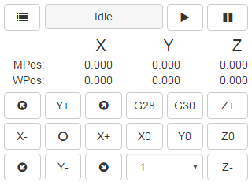

## Tutorial sobre como instalar o CNCJS no Raspberry

Este tutorial espera que o Raspberry já esteja com uma versão do Linux instalada e funcionando. Neste link [aqui](https://github.com/edilsoncorrea/instalarraspbian) você pode verificar um tutorial sobre como instalar o Raspbian.

[Tutorial muito bom sobre a instalação do CNCJS no Raspberry](https://github.com/cncjs/cncjs/wiki/Setup-Guide:-Raspberry-Pi-%7C-Install-Node.js-via-Package-Manager-*(Recommended)*) . Este tutorial corrente foi montado quase que inteiramente a partir dele. Referência: Mitch Bradley edited this page on 6 Feb 2021 · 21 revisions

### Instalar Node.js via Gerenciador de pacotes

```
curl -sL https://deb.nodesource.com/setup_10.x | sudo -E bash -
sudo apt install -y nodejs build-essential npm
sudo npm install -g npm@latest
```
  
Ignore os avisos dos passos do instalador do npm.  Segundo o autor do texto, o npm está apenas sendo chato.

```
sudo npm install -g cncjs@latest --unsafe-perm
```  

Se os comandos acima gerarem algum erro, você pode dar uma olhada [aqui](https://github.com/cncjs/cncjs/wiki/Setup-Guide:-Raspberry-Pi-%7C-Installation-Problems-and-Solutions) para possíveis soluções.

### Testando a instalação

Neste ponto você pode realizar um teste rápido para ver se o cncjs está funcionando. Entre isso no prompt do terminal:

```
cncjs
```

Algo parecido com isso deve ser mostrado no terminal:
>`2019-10-04T22:45:16.701Z - info init Loading configuration from "/home/pi/.cncrc"`
>
>`2019-10-04T22:45:17.931Z - info init Starting the server at http://127.0.1.1:8000`

Isso significa que o CNCJs está rodando e pronto para aceitar conexões a partir do navegador. A porta padrão é 8000. Tente acessar num navegador com o ip do raspberry. Algo parecido com "http://IP_DO_RASPBERRY:8000".

Como o CNCJs ainda não está sendo executado automaticamente como um serviço no Linux, você pode parar o que está sendo executado digitando ^C (Ctrl-C) no terminal.


### Carregar o servidor automaticamente

Para fazer o CNCJs iniciar automaticamente, entre esse código no prompt do terminal:

```
((crontab -l || true) | grep -v cncjs; echo "@reboot $(which cncjs) >>$HOME/cncjs.log 2>&1") | crontab -
```
Ele vai dizer que não há nenhum crontab para pi ("no crontab for pi"). Não se preocupe.

Este código parece bem complicado, mas caso esteja interessado, dê uma olhada no tutorial mencionado acima no tópico ["Autostarting the server"](https://github.com/cncjs/cncjs/wiki/Setup-Guide:-Raspberry-Pi-%7C-Install-Node.js-via-Package-Manager-*(Recommended)*). Lá há uma explicação detalhada sobre como este código funciona. 

Se você quiser desligar o auto-start, você pode entrar isto no prompt do terminal:

```
crontab -l | grep -v cncjs | crontab -
```
Se você estiver executando o Raspberry com uma tela e quiser usar o CNCJs num navegador local, dê uma olhada no tópico ["Autostarting the browser"](https://github.com/cncjs/cncjs/wiki/Setup-Guide:-Raspberry-Pi-%7C-Install-Node.js-via-Package-Manager-*(Recommended)*#autostarting-the-browser).

### Como instalar e usar a extensão de auto nivelamento no CNCJs

Entensão para ser utilizada para criação de placas de circuito impresso. Atualmente essa extensão é suportada para o GRBL: 
[Auto-leveling extension for CNCjs](https://github.com/kreso-t/cncjs-kt-ext)

### Como criar uma página simplificada de 240x240
[cncjs-pendant-tinyweb](https://github.com/cncjs/cncjs-pendant-tinyweb)


[]
